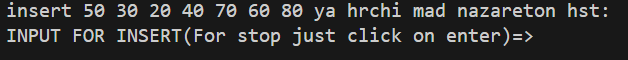
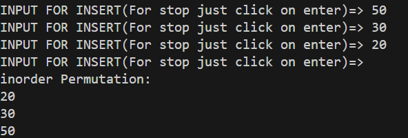
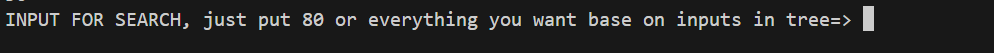
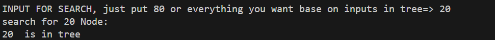
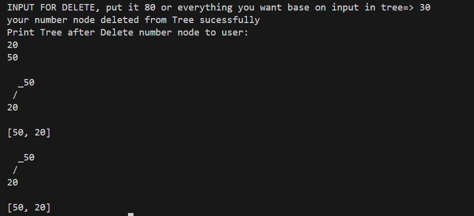
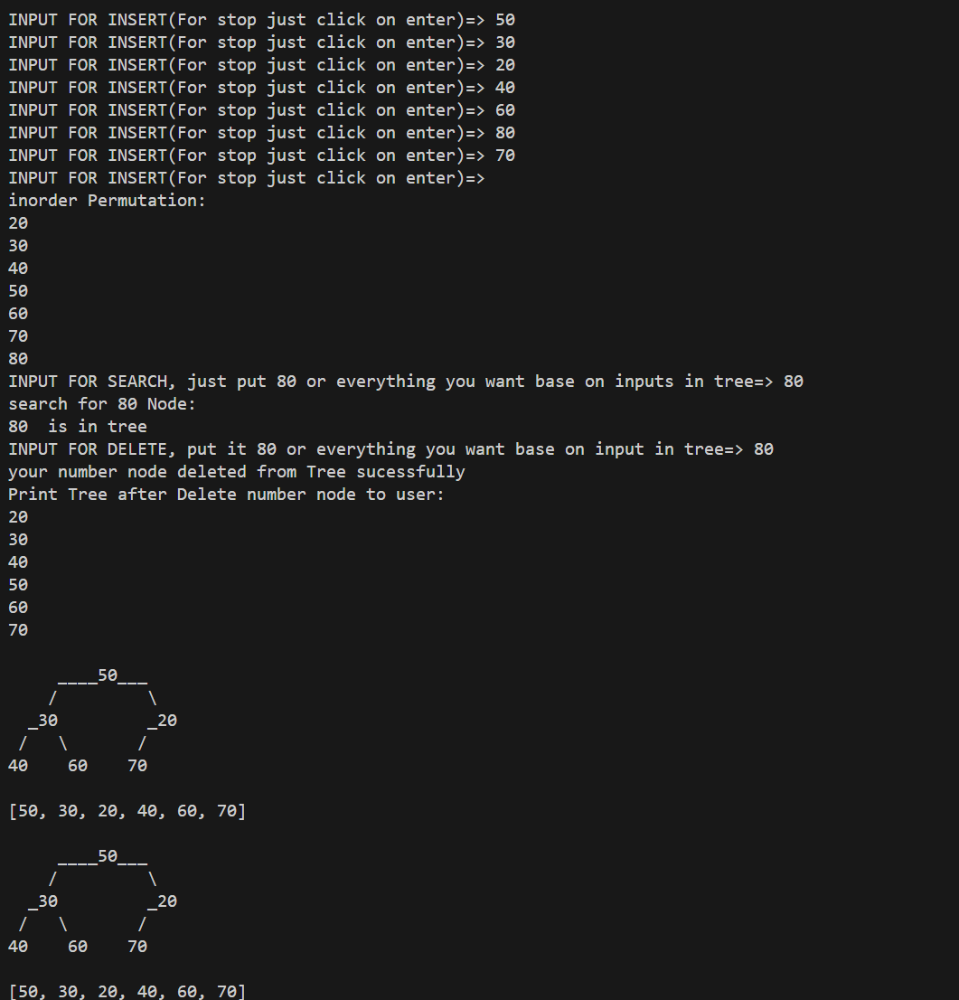

# 🎉BinarySearchTree project
## 🧑Manual
-> everything is in the venv

```bash
pi
```

##### create and virtual environment and install these:
```
pip install binarytree 
```
```
pip install pydot
```
## 👷How work with it

### in here as an input just put a number any number you want



### if you are done with number just leave it alone and click enter



### you gave the tree your number if you want to see your specific number exist in the tree



### it will say to you it exist or not



### delete a number from tree


### in the end shows you the tree




## 🎥preview


## 👨‍💻Used Technologies

- python
- pydot
- binarytree
