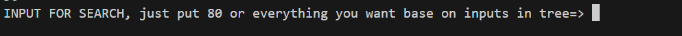

# 🎉BinarySearchTree project
## ✍️This is for my university's project
## 🧑Manual
### everything is in the venv
##### if you dont want use venv:
```
pip install binarytree 
```
```
pip install pydot
```
## 👷How work with it

### in here as an input just put a number any number you want


### if you are done with number just leave it alone and click enter


### you gave the tree your number if you want to see your specific number exist in the tree



### it will say to you it exist or not


### delete a number from tree


### in the end shows you the tree


## 🎥preview


## 👨‍💻Used Technologies

- python
- pydot
- binarytree
